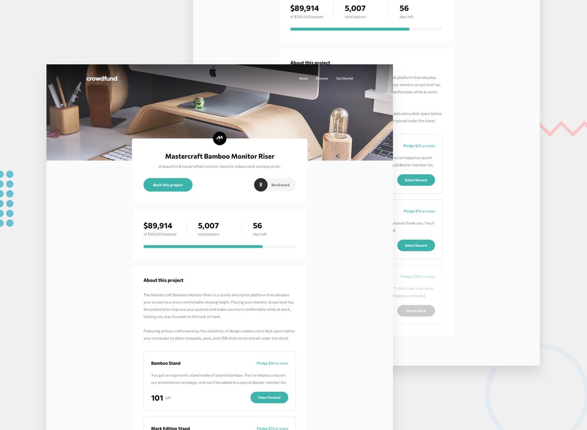

# Frontend Mentor - Crowdfunding product page solution

This is a solution to the [Crowdfunding product page challenge on Frontend Mentor](https://www.frontendmentor.io/challenges/crowdfunding-product-page-7uvcZe7ZR). Frontend Mentor challenges help you improve your coding skills by building realistic projects.

## Overview

### The challenge

Users should be able to:

- View the optimal layout depending on their device's screen size
- See hover states for interactive elements
- Make a selection of which pledge to make
- See an updated progress bar and total money raised based on their pledge total after confirming a pledge
- See the number of total backers increment by one after confirming a pledge
- Toggle whether or not the product is bookmarked

### Screenshot



### Links

- Live Site URL: https://soft-crowd-funding-page.netlify.app

## My process

### Built with

- Semantic HTML5 markup
- SCSS
- Flexbox
- Mobile-first workflow
- Vanilla Javascript

### What I learned

The major this i learnt is how to change management states with modals, buttons and and radio input

- I also learned how to make a range slider increse based on the increament of a value

```html
<h1>Some HTML code I'm proud of</h1>
```

```
{
  range.value = parseInt(amountRaised.textContent) / 1000;
}
```

## Author

- Frontend Mentor - [Nneoma Peace](https://www.frontendmentor.io/profile/SatellitePeace)
